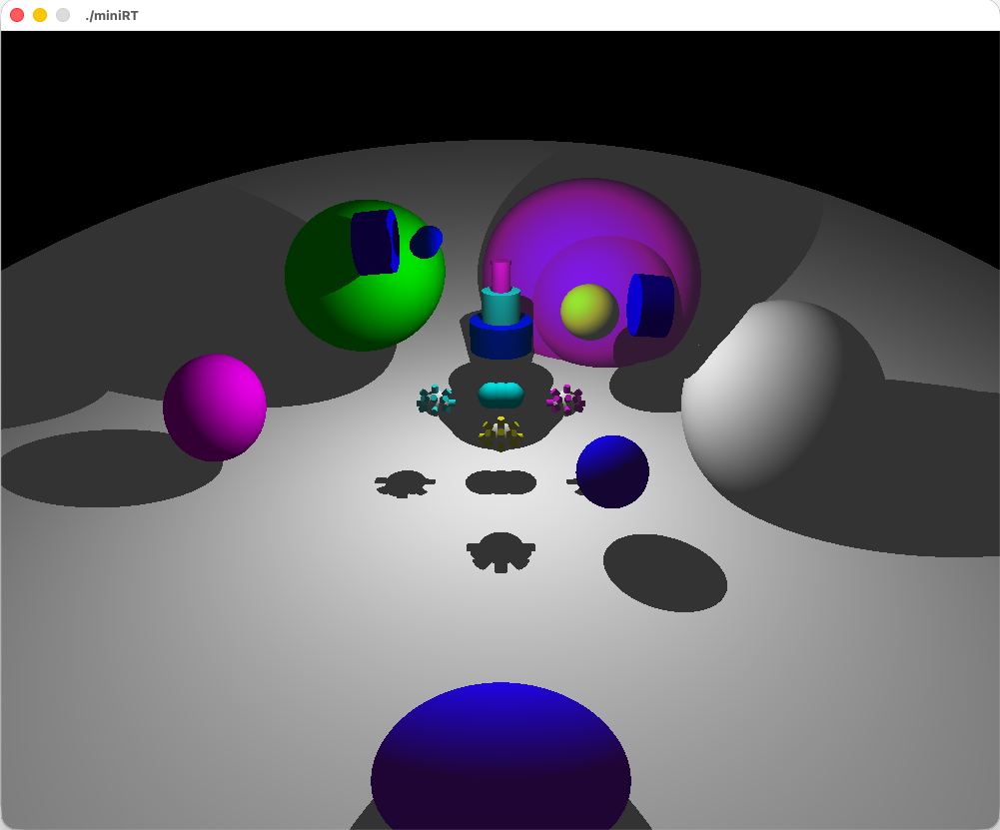

# miniRT
### 간단한 레이트레이서


## 프로젝트 소개

miniRT는 C를 사용하여 norminette라는 코딩 컨벤션을 지키며 작성해야하는 ecole42 4circle 과제입니다.

빛 반사, 굴절, 카메라 왜곡 처리 없이, 카메라에서부터 시작해 가장 먼저 닿은 물체에서 다시 한번 출발해 점광원에 도달할 수 있는지 검증하는 간단한 방식의 레이트레이서입니다.

## project info
```md
Program name : miniRT
Makefile : all, clean, fclean, re
허용 함수 :
  - open, close, read, write, printf, malloc, free, perror, strerror, exit
  - All funcions of the math library
  - All funtions of thr minilibx(mlx : gui 앱 라이브버리)
```

### 작동 방법
Makefile 사용법
```shell
make all # 실행파일 생성
make clean # 실행파일 제외 모든 생성된 파일 제거
make fclean # 실행파일 포함해 모든 생성된 파일 제거
make re # 모든 생성파일 제거 후 실행파일 재생성

make test # test dir의 만들어둔 잘못된 문법의 rt파일들을 실행해 모든 종류의 예외처리를 확인할 수 있고 마지막에 (나름 열심히 구성한) 다양한 도형을 넣은 파일 렌더링
make norm # 42 C 
```

해석할 파일이 될 하나의 인자가 필요하다
```shell
./miniRT [filename].rt
```

해석할 파일의 요소 해석
```rt
Ambient lightning
identifier  ratio[0.0, 1.0]   RGB
A	           0.2					    255,255,255

Camera
identifier  location(x,y,z)  vector  FOV
C           20,-2,3          -1,0,0  180

Light (점광원)
identifier  location(x,y,z)  ratio[0.0,1.0]  RGB
L           0,4.5,3          0.7             255,255,255

Plane
identifier  location(x,y,z)  vector  RGB
pl          0,0,-24		0,0,1					10,10,255

Cylinder
identifier  
cy	 0,4,3  0,1,0	 2 2  200,20,20

Sphere
identifier  
sp  0,10,0 2.5 150,80,80
```
